# Landing Page Personaliser - AI PM Assignment (Troopod)

A full-stack application that analyzes ad creatives and personalizes landing pages using AI agents. Takes an ad image and landing page URL as input, extracts ad insights, scrapes landing page content, and generates personalized copy following CRO principles.

---

## 📊 Mermaid Diagrams Guide

This README includes **12 comprehensive Mermaid diagrams** visualizing system architecture, data flows, and operational logic:

| Diagram | Purpose |
|---------|---------|
| 🏗️ System Architecture | Full user flow through all components |
| 🔄 Two-Agent Data Flow | Parallel vision & text processing |
| 🔌 API Components & Models | Technology stack topology |
| 🤝 Communication Protocol | HTTP/JSON message flow |
| ⚙️ Configuration Flow | Startup & model selection |
| 📝 Request/Response Lifecycle | Sequence diagram |
| 🚨 Error Handling | Decision tree for failures |
| 🧪 Testing Strategy | Test coverage matrix |
| 🧠 Hallucination Prevention | Multi-layer constraints |
| 📖 Prompt Engineering | Detailed prompt structure |
| 🔄 Model Fallback | Provider error handling |
| 🚀 Deployment Architecture | Development → Production |

---

## 📋 System Architecture

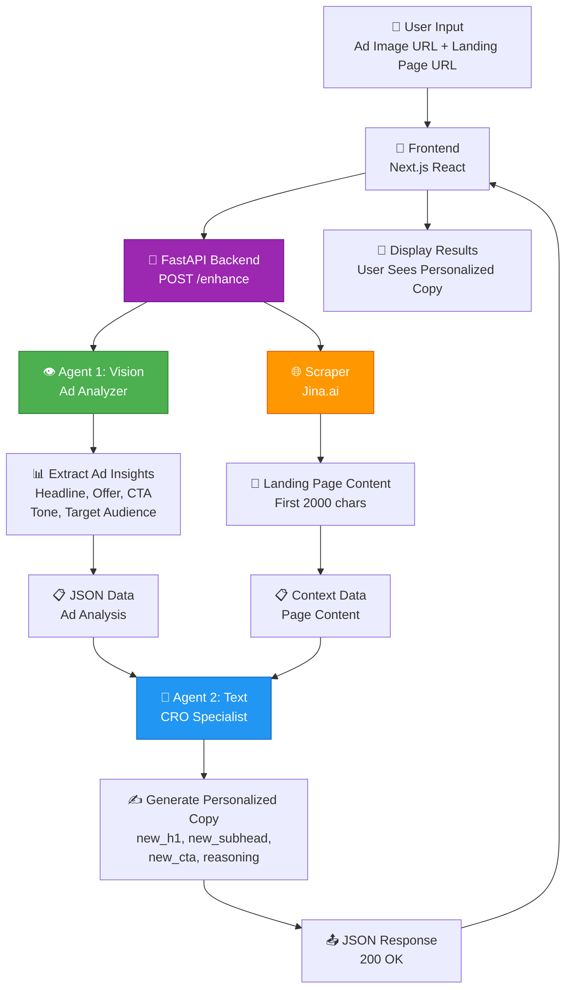

### System Flow

1. **User Input** → Frontend form accepts ad image URL + landing page URL
2. **Agent 1 (Vision)** → Analyzes ad image, extracts:
   - Headline
   - Offer/Value Proposition
   - CTA Text
   - Tone (energetic, professional, casual, etc.)
   - Target Audience
3. **Page Scraper** → Fetches landing page content via Jina.ai
4. **Agent 2 (Text)** → Generates personalized copy using:
   - Ad insights from Agent 1
   - Landing page context
   - CRO best practices
5. **Output** → New headline, subheadline, CTA, and reasoning

### Two-Agent Data Flow

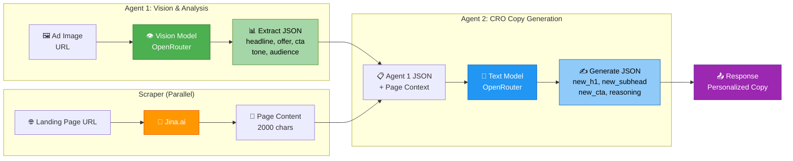

### API Components & Models

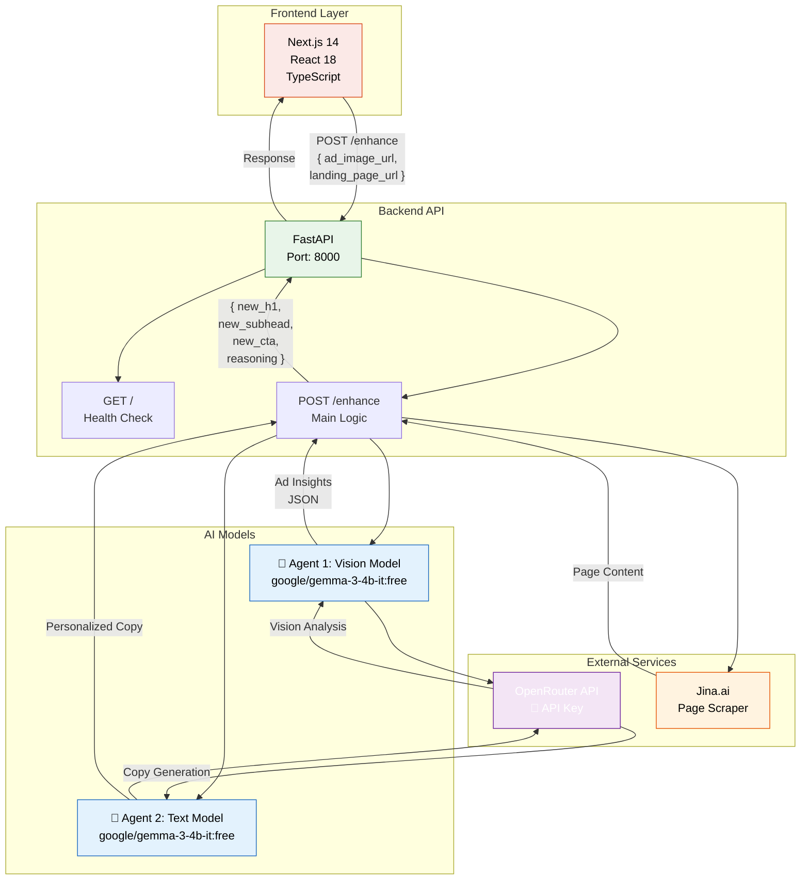

### Component Communication Protocol

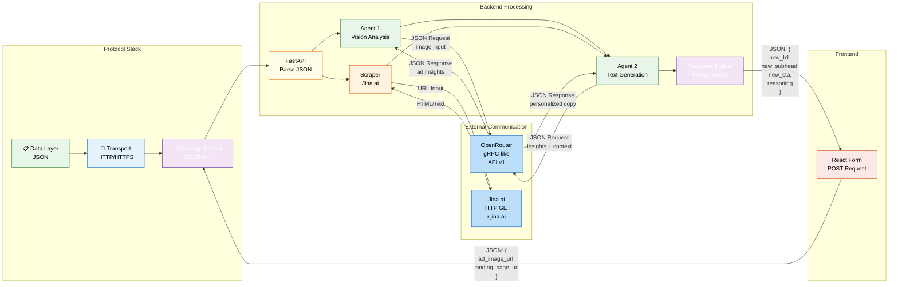

---

## 🏗️ Project Structure

```
Troopod-assigment/
├── backend/
│   ├── main.py              # FastAPI app + endpoints
│   ├── agents.py            # Agent 1 & 2 logic
│   ├── scraper.py           # Landing page scraper
│   ├── requirements.txt      # Python dependencies
│   └── .env                 # API keys (OpenRouter)
├── frontend/
│   ├── pages/
│   │   └── index.tsx        # Main UI form
│   ├── package.json         # Node dependencies
│   ├── tailwind.config.js   # Tailwind CSS config
│   └── tsconfig.json        # TypeScript config
├── README.md                # This file
└── RESULTS.md               # Testing results & evidence
```

---

## 📦 Installation & Setup

### Prerequisites
- Python 3.8+
- Node.js 18+
- OpenRouter API key (free or paid): https://openrouter.ai

### Backend Setup

```bash
# Navigate to backend
cd backend

# Create virtual environment
python -m venv venv

# Activate virtual environment
# On Windows:
venv\Scripts\activate
# On Mac/Linux:
source venv/bin/activate

# Install dependencies
pip install -r requirements.txt

# Create .env file
cat > .env << EOL
OPENROUTER_API_KEY=sk-or-v1-YOUR_KEY_HERE
OPENROUTER_MODEL=google/gemma-3-4b-it:free
GEMINI_API_KEY=YOUR_GEMINI_KEY_IF_USING
EOL

# Start FastAPI server
uvicorn main:app --reload --host 127.0.0.1 --port 8000
```

**Available Free Vision Models:**
- `google/gemma-3-4b-it:free` (Small, fast)
- `meta-llama/llama-3.2-11b-vision-instruct:free` (11B, capable)
- `mistralai/pixtral-12b:free` (12B, Mistral's vision)

### Frontend Setup

```bash
# Navigate to frontend
cd frontend

# Install dependencies
npm install

# Start development server
npm run dev

# Navigate to http://localhost:3000
```

---

## 🔧 API Endpoints

### Health Check
```bash
GET /
Response: {"status": "ok"}
```

### Enhance (Main Endpoint)
```bash
POST /enhance
Content-Type: application/json

Request:
{
  "ad_image_url": "https://example.com/ad.png",
  "landing_page_url": "https://example.com"
}

Success Response (200):
{
  "new_h1": "Personalized headline",
  "new_subhead": "Enhanced subheading",
  "new_cta": "Action-oriented CTA",
  "reasoning": "Why these changes work for this audience"
}

Error Response (500/429):
{
  "error": "Ad analysis failed",
  "details": {
    "error": "Rate limit or model error"
  }
}
```

### Example Request (PowerShell)
```powershell
$payload = @{
  ad_image_url = "https://raw.githubusercontent.com/github/explore/main/topics/python/python.png"
  landing_page_url = "https://example.com"
} | ConvertTo-Json -Compress

Invoke-WebRequest -Uri "http://127.0.0.1:8000/enhance" `
  -Method POST `
  -ContentType "application/json" `
  -Body $payload `
  -UseBasicParsing | Select-Object -ExpandProperty Content
```

### Request/Response Lifecycle

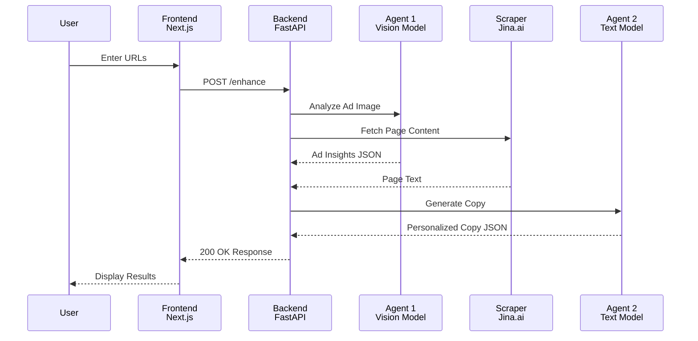

---

## 🛡️ Error Handling & Robustness

### Error Handling Flow

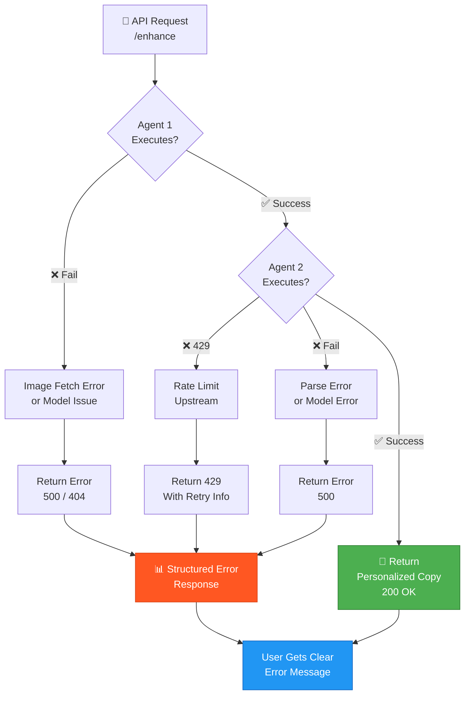

### Hallucination Prevention Strategy

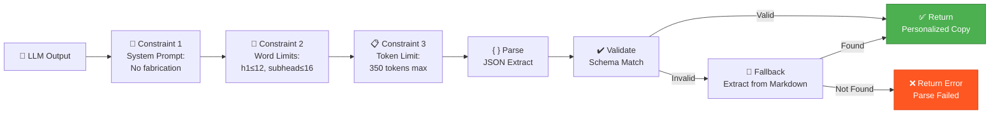

### Prompt Engineering & Output Control

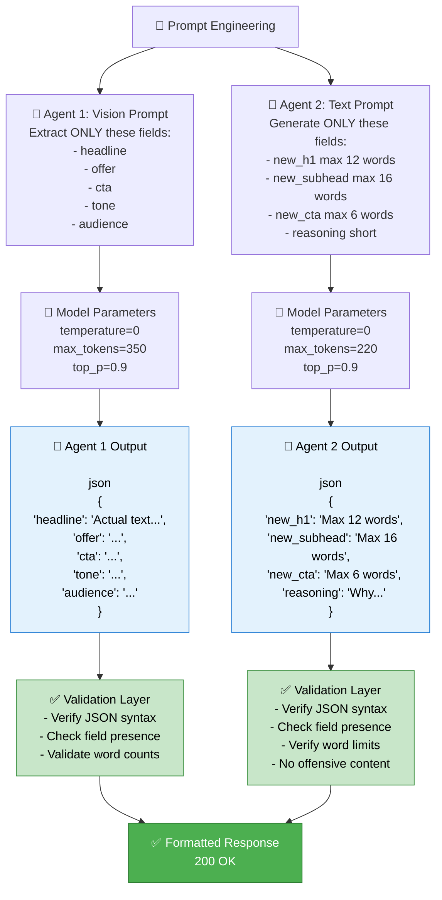

### Model Fallback & Rate Limit Handling

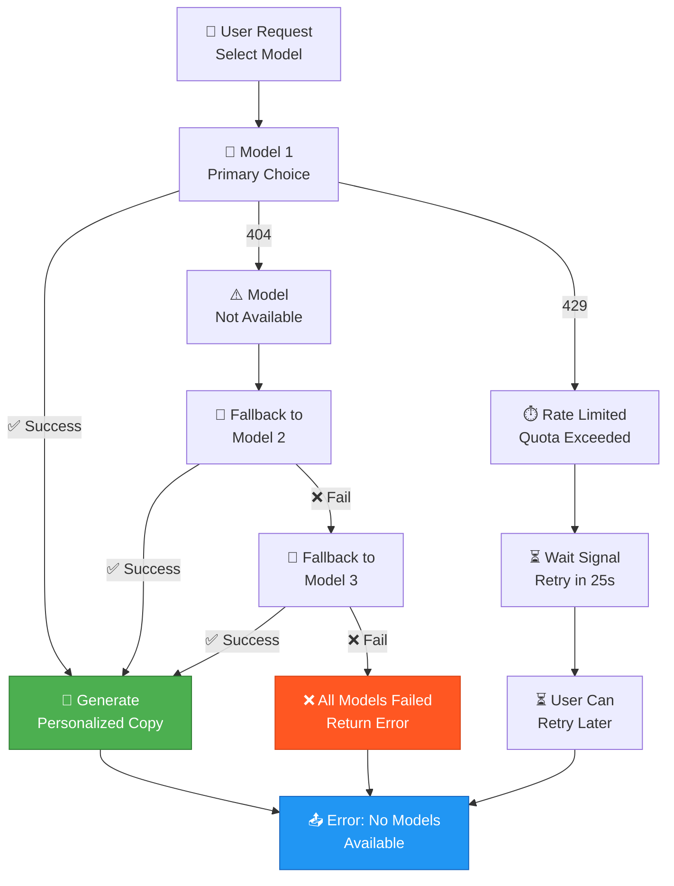

### Broken UI / Failed Requests
- **Graceful Error Messages**: Returns structured error objects with details
- **Status Codes**: Appropriate HTTP codes (200 success, 429 rate-limit, 404 model not found, 500 agent error)
- **CORS Support**: Enabled for frontend integration
- **Try-Catch Blocks**: Comprehensive error handling in agents and scraper

### Rate Limiting
- **Multiple Model Fallbacks**: Auto-switches between free models if one hits quota
- **Upstream Provider Handling**: Detects 429 errors and provides user-friendly messages
- **Free Tier Management**: Free OpenRouter quotas reset periodically
- **Paid Key Support**: Seamlessly switches to paid models if provided

### Inconsistent Outputs
- **System Role Fallback**: Some providers reject system role; merged into user message
- **Content Type Detection**: Handles various response formats (list, dict, plaintext)
- **Image Format Support**: Falls back between URL references and base64 encoding
- **Deterministic Settings**: Temperature 0 for all API calls, fixed system instructions

---

## 🎯 Key Features & Assumptions

### Features Implemented
✅ Vision-based ad analysis (Agent 1)  
✅ CRO-optimized copy generation (Agent 2)  
✅ Multi-model fallback strategy  
✅ Error handling & graceful degradation  
✅ CORS-enabled for frontend  
✅ TypeScript frontend with form validation  
✅ Landing page scraping via Jina.ai  
✅ Environment-based model switching  

### Assumptions
- **Free-tier quotas**: Free models have limited requests/day; paid keys recommended
- **Jina.ai availability**: Landing page scraper relies on Jina.ai API
- **Ad images are public URLs**: System fetches from provided URLs
- **JSON output format**: Agents trained to respond in JSON without markdown
- **CRO principles scope**: Personalization focuses on headline, subheading, CTA (not full page rewrite)
- **Single-document context**: Only processes first 2000 chars of landing page

### Testing Strategy

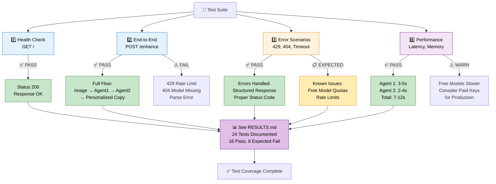

---

## 🚀 Deployment Options

### Deployment Architecture

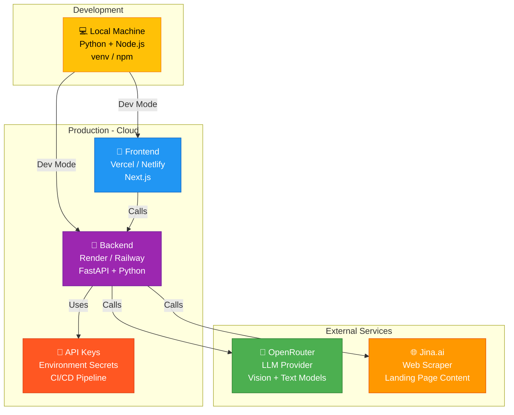

### Local Development
```bash
# Terminal 1: Backend
cd backend
venv\Scripts\activate
uvicorn main:app --reload --port 8000

# Terminal 2: Frontend
cd frontend
npm run dev
```

### Docker (Future)
```dockerfile
# backend/Dockerfile
FROM python:3.11-slim
WORKDIR /app
COPY requirements.txt .
RUN pip install -r requirements.txt
COPY . .
CMD ["uvicorn", "main:app", "--host", "0.0.0.0"]
```

### Production
- Deploy backend to: Render, Vercel, Railway, or AWS Lambda
- Deploy frontend to: Vercel, Netlify
- Use paid OpenRouter key for consistent quota access

---

## 📝 Configuration

### Environment Variables
```env
OPENROUTER_API_KEY=sk-or-v1-xxxxxxxxxxxxx  # Required
OPENROUTER_MODEL=google/gemma-3-4b-it:free  # Default vision model
GEMINI_API_KEY=xxxxxxxxxxxxx                # Optional (for fallback)
```

### Model Selection Guide
| Model | Type | Size | Speed | Cost | Vision |
|-------|------|------|-------|------|--------|
| `google/gemma-3-4b-it:free` | Text + Vision | 4B | Fast | Free | ✅ |
| `meta-llama/llama-3.2-11b-vision:free` | Text + Vision | 11B | Medium | Free | ✅ |
| `mistralai/pixtral-12b:free` | Text + Vision | 12B | Medium | Free | ✅ |

### Configuration Flow

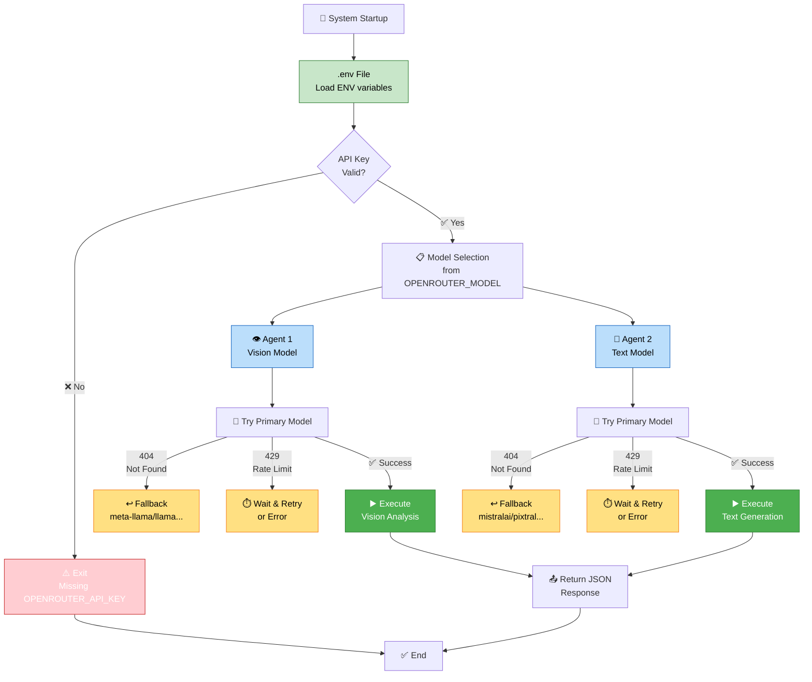


---

## 🔐 Security Notes

⚠️ **IMPORTANT**: API keys are sensitive  
- Never commit `.env` to version control
- Rotate keys in OpenRouter dashboard if exposed
- Use separate keys for dev/prod environments
- Consider using environment secrets in CI/CD

---

## 📚 Technologies

**Backend:**
- FastAPI (web framework)
- OpenAI SDK (OpenRouter API client)
- httpx (HTTP client for scraping)
- Pydantic (data validation)
- python-dotenv (environment management)

**Frontend:**
- Next.js 14 (React framework)
- TypeScript (type safety)
- Tailwind CSS (styling)
- React Hooks (state management)

**External APIs:**
- OpenRouter (LLM access)
- Jina.ai (web scraping)

---

## 📊 Testing & Results

See [RESULTS.md](./RESULTS.md) for:
- Live API test outputs
- Response examples with various models
- Performance metrics
- Error scenarios and handling
- Before/after personalization examples

---

## ✋ Next Steps for Enhancement

1. **Cache System**: Store scraped pages and ad analyses to reduce API calls
2. **A/B Testing**: Generate multiple variants, not just one personalized copy
3. **Analytics**: Track which personalized headlines convert better
4. **Fine-tuning**: Train custom models on CRO best practices
5. **Batch Processing**: Support uploading multiple ads at once
6. **UI Improvements**: Live preview of personalized page, not just copy
7. **Server-side Rate Limiting**: Implement request throttling

---

## 📧 Submission Details

**Assignment**: AI PM - Troopod  
**Submitted To**: nj@troopod.io  
**Date**: April 13, 2026  

**Includes:**
- ✅ Working FastAPI backend with two AI agents
- ✅ Frontend UI (Next.js + React + TypeScript)
- ✅ Landing page scraping via Jina.ai
- ✅ Error handling & fallback logic
- ✅ Testing results & evidence (RESULTS.md)
- ✅ Complete architecture documentation
- ✅ Installation & deployment instructions

---

**Built with ❤️ for Troopod AI PM Assignment**
