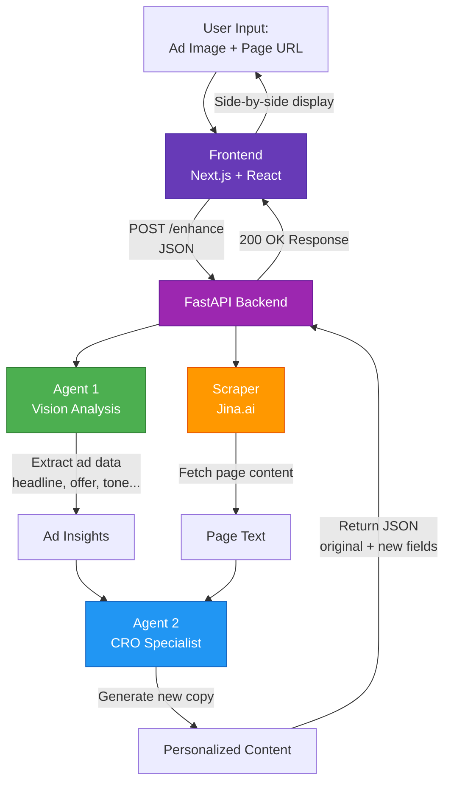
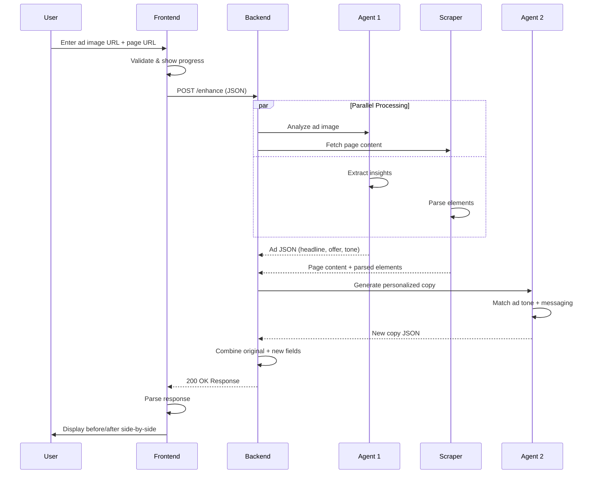
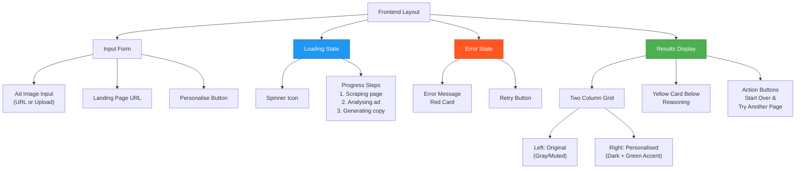
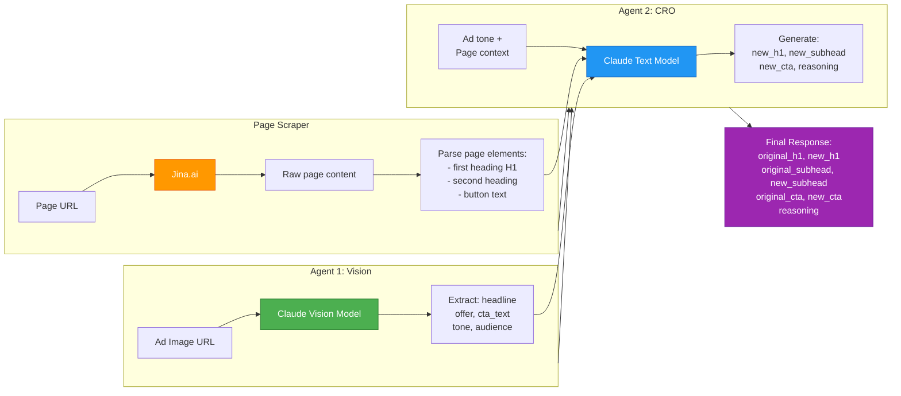
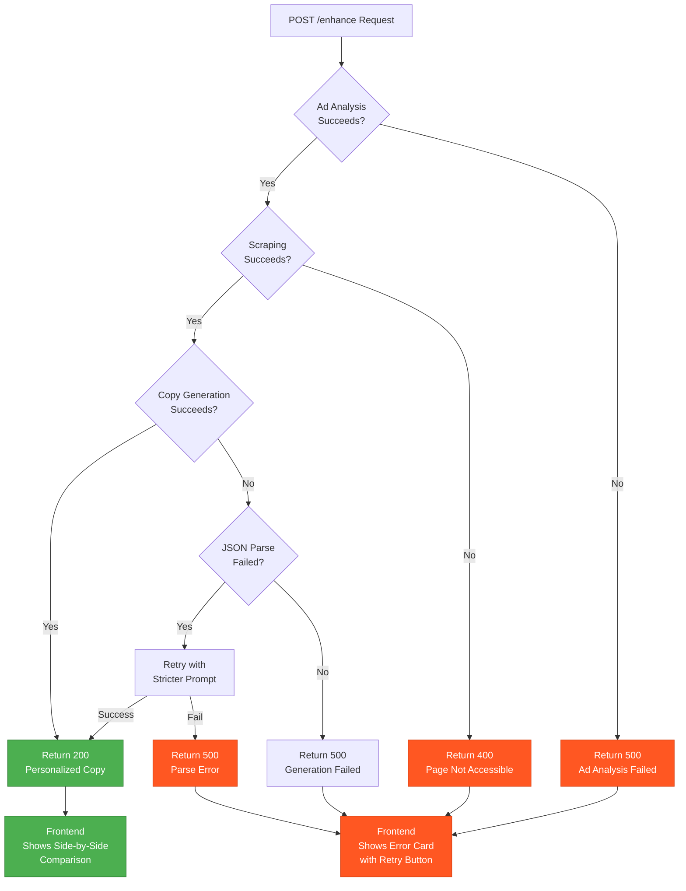

# Landing Page Personaliser - AI PM Assignment (Troopod)

A full-stack application that analyzes ad creatives and personalizes landing pages using AI agents. Users input an ad image URL (or upload a file) and a landing page URL. The system scrapes the landing page, runs two AI agents, and returns personalized copy (headline, subheadline, CTA button text) that better matches the ad messaging. Results are displayed side-by-side showing before/after comparison.

---

## Quick Setup

### Prerequisites
- **Python 3.9+** (backend)
- **Node.js 18+** (frontend)
- **OpenRouter API key** (free tier available)

### Backend Setup (60 seconds)

```bash
cd backend
python -m venv venv
# On Windows: venv\Scripts\activate
# On Mac/Linux: source venv/bin/activate
pip install -r requirements.txt

# Create .env file with your OpenRouter credentials
echo "OPENROUTER_API_KEY=sk-or-v1-YOUR_KEY_HERE" > .env
echo "OPENROUTER_MODEL=anthropic/claude-sonnet-4-20250514" >> .env

# Start server
uvicorn main:app --reload
# Backend running at http://localhost:8000
```

### Frontend Setup (60 seconds)

```bash
cd frontend
npm install
npm run dev
# Frontend running at http://localhost:3000
```

**That's it!** Open http://localhost:3000 in your browser.

---

## System Architecture Diagrams

### Overall System Flow



### Request/Response Lifecycle



### Frontend UI Layout



### Two-Agent Data Flow



### Error Handling Flow



## How It Works

1. User Input - Upload ad image (file or URL) and paste landing page URL
2. Backend Processing - Agent 1 analyzes the ad to extract headline, offer, CTA, tone, target audience
3. Page Scraping - Fetches landing page content via Jina.ai and parses original elements
4. CRO Optimization - Agent 2 generates personalized copy matching the ad messaging
5. Results Display - Shows side-by-side comparison: original (left) vs personalized (right)

---

## API Contract

### POST /enhance

**Request:**
```json
{
  "ad_image_url": "https://example.com/ad.jpg or data:image/png;base64,...",
  "landing_page_url": "https://example.com/landing"
}
```

**Success Response (200):**
```json
{
  "original_h1": "Current page headline",
  "new_h1": "Personalised headline",
  "original_subhead": "Current page subheadline",
  "new_subhead": "Personalised subheadline",
  "original_cta": "Original button text",
  "new_cta": "Personalised button text",
  "reasoning": "One-sentence explanation of the changes"
}
```

**Error Response (400/500):**
```json
{
  "error": "Clear error message describing what failed"
}
```

---

## Key Features Implemented

- File Upload + URL Input - Support both ad image upload and direct URLs
- Side-by-Side Display - Before/after comparison with color-coded styling
- Multi-Step Progress Indicator - Cycles through loading steps (Scraping → Analysing → Generating)
- Error Handling - Clear error messages with "Retry" button
- Start Over Button - Reset all state and form
- Configurable API Endpoint - Use NEXT_PUBLIC_API_URL environment variable
- Agent Prompt Optimization - Exact specifications with temperature=0 for deterministic output
- JSON Retry Logic - On parse failure, retry with stricter prompt; fallback to error dict
- CORS Security - Restricted to localhost:3000
- Environment Validation - Clear startup errors if API keys missing
- Structured Logging - Debug-level logs for troubleshooting

---

## Agent Specifications

### Agent 1: Ad Analyst

**System Prompt:**
> You are an expert ad analyst. Extract structured data from ad creatives. Return raw JSON only. No markdown. No explanation. No code blocks.

**Returns:**
```json
{
  "headline": "the main headline or hook of the ad",
  "offer": "the specific offer, discount, or benefit being promoted",
  "cta_text": "the call to action text",
  "tone": "one word only: urgent OR warm OR bold OR playful OR professional",
  "target_audience": "who this ad is speaking to in 5 words or less"
}
```

**Settings:** temperature=0, max_tokens=350

### Agent 2: CRO Specialist

**System Prompt:**
> You are a senior CRO specialist with 10 years experience. You personalise landing pages to match ad creatives. Increase message match between ad and page. Return raw JSON only. No markdown. No explanation. No code blocks. Critical rule: Only use claims, offers, and benefits that appear in the ad data. Never invent new features, prices, or guarantees.

**Returns:**
```json
{
  "new_h1": "new headline that echoes the ad promise",
  "new_subhead": "new subheadline that expands on the ad offer",
  "new_cta": "new CTA button text that matches ad action",
  "reasoning": "one sentence explaining what you changed and why"
}
```

**Settings:** temperature=0, max_tokens=220

---

## Project Structure

```
backend/
├── main.py              # FastAPI app, /enhance endpoint, CORS config
├── agents.py            # Agent 1 & 2 implementations with retry logic
├── scraper.py           # Page scraping + content parsing
└── requirements.txt     # Python dependencies (pinned versions)

frontend/
├── pages/
│   ├── _app.tsx         # Next.js app wrapper
│   └── index.tsx        # Main UI with form, file upload, results display
├── styles/
│   └── globals.css      # Tailwind styles
└── package.json         # Node dependencies

README.md                # This file
RESULTS.md              # Testing results & examples
.gitignore              # Git ignore patterns
```

---

## CORS & Security

**Allowed Origins:**
- http://localhost:3000
- http://127.0.0.1:3000
- (TODO: Add production frontend URL)

**Update for Production:**
Edit backend/main.py line ~45 and add your Vercel domain or other frontend URL.

---

## Dependencies

### Backend (Requirements.txt)
```
fastapi==0.104.1
uvicorn==0.24.0
httpx==0.25.2
python-dotenv==1.0.0
pydantic==2.5.2
openai==1.12.0
```

### Frontend (package.json)
```
next@^14.0.0
react@^18.0.0
react-dom@^18.0.0
typescript@^5.0.0
tailwindcss@^3.0.0
```

---

## Environment Variables

### Backend (.env)
```
OPENROUTER_API_KEY=sk-or-v1-YOUR_KEY_HERE
OPENROUTER_MODEL=anthropic/claude-sonnet-4-20250514
```

### Frontend (.env.local - optional)
```
NEXT_PUBLIC_API_URL=http://localhost:8000
```

---

## Troubleshooting

| Issue | Solution |
|-------|----------|
| Backend won't start | Check `.env` file has valid `OPENROUTER_API_KEY` |
| Frontend can't connect | Ensure backend running on `http://localhost:8000` |
| Page scraping fails | Verify URL is accessible; some pages block Jina.ai |
| Ad image analysis failed | Try URL first; file upload must be under 4MB |
| Rate limit error (429) | OpenRouter quota exhausted; use paid key or wait |

---

## Testing

### Manual Test Flow
1. Open http://localhost:3000
2. Upload an ad image (or paste URL)
3. Enter a landing page URL (e.g., https://example.com)
4. Click "Personalise"
5. Wait for progress indicator to cycle through steps
6. View results: original (left) vs personalised (right)
7. Click "Start over" to test another page

### Sample Test URLs
- **Landing Page**: https://example.com, https://example.org
- **Ad Image**: Any public image URL (JPG, PNG, GIF, WebP)

---

## Files Modified During Audit

### Backend (Phase 1)
- agents.py - Updated prompts, added retry logic, temperature=0
- scraper.py - Added parse_page_elements(), improved error handling
- main.py - Fixed CORS, updated /enhance response shape, added logging
- requirements.txt - Pinned versions, removed unused dependencies

### Frontend (Phase 2)
- pages/index.tsx - Complete rewrite: file upload, before/after display, progress indicator, error retry, start over button

### Configuration (Phase 3)
- .gitignore - Added .env.local, organized patterns
- README.md - Updated with setup, API contract, troubleshooting

---

## Next Steps

This is a working assignment submission. For production use:

1. **Deploy Backend**: Push to Render, Railway, or Vercel (serverless)
2. **Deploy Frontend**: Push to Vercel or Netlify
3. **Use Paid OpenRouter Key**: Free tier has daily quotas
4. **Set Environment Variables**: In hosting platform's dashboard
5. **Update CORS Domain**: Change allowed_origins in main.py
6. **Monitor Usage**: Track OpenRouter API costs and Jina.ai quotas
7. **Add Caching**: Store results to reduce API calls
8. **Implement Analytics**: Track personalization effectiveness

---

## Contact

For questions or issues, refer to:
- Backend logs: Terminal where `uvicorn main:app` is running
- Frontend console: Browser DevTools → Console
- API responses: Check error messages in red card on UI

---

**Built with passion for Troopod AI PM Assignment**  
**April 2026**
